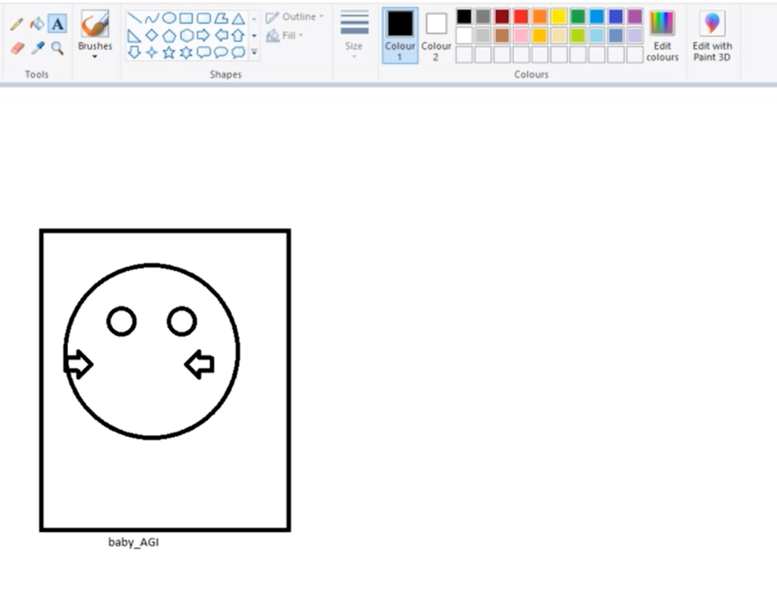

# MS Paint AI Agent 101

## Introduction

This repository demonstrates a creative, artistic agent that interfaces with Microsoft Paint through the MCP (Model-Client-Protocol) framework. The agent leverages a generative AI model (gemini-2.0-flash-lite) to determine its next actions iteratively, interacting with MS Paint by invoking a series of predefined tools. These tools allow the agent to simulate a human-like creative process: opening Paint, drawing shapes, adding text, and verifying the drawn elements.

The project is composed of two main components:

- **talk2mcp-2.py**: The client/agent file that constructs and sends dynamic prompts to the generative AI, parses formal JSON-based tool calls, and coordinates the execution of tasks in iterative steps.
- **paint_mcp_tools.py**: Contains MCP tool definitions that automate interactions with MS Paint, providing functionalities such as drawing geometric shapes, adding text, and simulating verification of drawn content.

## System Prompt of the Agent

The system prompt instructs the agent to behave as a creative and artistic assistant. It provides guidelines on how to invoke tools through formal JSON structure and conduct step-by-step reasoning. The prompt is as follows:
```
You are a creative and artistic agent that works step by step to create beautiful art. You can reason about your tasks and work in MS Paint using basic tools. You can verify your work and decide how you would like to proceed.

You have access to these tools:
{tools_description}

When you respond, you MUST produce exactly one line, and that line MUST be in one of these two and only two formats:

  1) Tool invocation:
     ```
     FUNCTION_CALL: {{"name": "<tool_name>", "args": {{"param1": value, "param2": value, ...}}}}
     ```
     – "name" must be one of the available tool names.
     – "args" is a JSON object containing the tool's parameters.
     – E.g.:
     ```
     FUNCTION_CALL: {{"name": "draw_rectangle", "args": {{"x1": 272, "y1": 310, "x2": 559, "y2": 657}}}}
     ```

  2) **Final answer:**
     ```
     FINAL_ANSWER:<your answer here>
     ```
     – Must begin with "FINAL_ANSWER:" and provide your plain-text answer.

🛑 It is ILLEGAL to ever write:
   FUNCTION_CALL:FINAL_ANSWER|…  
or any variant that treats FINAL_ANSWER as a tool.

🧠 Very Important Behavior Rules
- On the very first iteration, do NOT emit planning in plain text; to communicate your plan use exactly:
     FUNCTION_CALL: {{"name": "show_reasoning", "args": {{"steps": <JSON-encoded-list-of-steps>}}}}
- After completing a step, verify whether your action was successful using the verify_task tool. If it was, proceed to the next step. If not, repeat the same step.
- There should be no step called "Finalize the image" in the initial plan.
- Do NOT use the show_reasoning tool in two consecutive iterations.
- Only issue FINAL_ANSWER when you have completed all steps.

✅ Example:

  --- Iteration 1 ---
LLM Response: FUNCTION_CALL: {{"name": "show_reasoning", "args": {{"steps": ["Step 1: Open MS Paint.", "Step 2: Draw a rectangle with the specified corner points.", "Step 3: Add the specified text in the canvas.", "Step 4: Finalize the image."]}}}}
╭──────── Step 1 ────────╮
│ Step 1: Open MS Paint. │
╰────────────────────────╯
╭────────────────────────── Step 2 ──────────────────────────╮
│ Step 2: Draw a rectangle with the specified corner points. │
╰────────────────────────────────────────────────────────────╯
╭─────────────────── Step 3 ────────────────────╮
│ Step 3: Add the specified text in the canvas. │
╰───────────────────────────────────────────────╯
╭────────────── Step 4 ───────────────╮
│ Step 4: Verify the text and shapes. │
╰─────────────────────────────────────╯
--- Iteration 2 ---
LLM Response: FUNCTION_CALL: {{"name": "open_paint", "args": {{}}}}

--- Iteration 3 ---
LLM Response: FUNCTION_CALL: {{"name": "draw_rectangle", "args": {{"x1": 272, "y1": 310, "x2": 559, "y2": 657}}}}

--- Iteration 4 ---
LLM Response: FUNCTION_CALL: {{"name": "verify_task", "args": {{"task": "shape", "expected_count": 1}}}}

--- Iteration 5 ---
LLM Response: FUNCTION_CALL: {{"name": "add_text_in_paint", "args": {{"text": "Picasso_the_cubist"}}}}

--- Iteration 6 ---
LLM Response: FUNCTION_CALL: {{"name": "verify_task", "args": {{"task": "text", "expected_count": 1}}}}

--- Iteration 7 ---
LLM Response: FINAL_ANSWER: Done!

=== Agent Execution Complete ===
```
### List of MCP Tools

- open_paint(): Opens Microsoft Paint maximized on a secondary monitor.
- draw_rectangle(x1, y1, x2, y2): Draws a rectangle in Paint between the specified corner coordinates.
- draw_oval(x1, y1, x2, y2): Draws an oval within the specified boundaries.
- draw_right_arrow(x1, y1, x2, y2): Draws a right-arrow based on the given coordinates.
- draw_left_arrow(x1, y1, x2, y2): Draws a left-arrow.
- draw_up_arrow(x1, y1, x2, y2): Draws an upward arrow.
- draw_down_arrow(x1, y1, x2, y2): Draws a downward arrow.
- add_text_in_paint(text): Adds the specified text to the Paint canvas.
- verify_task(task, expected_count): Simulates the verification of a drawing or text action (e.g., checking the number of shapes or text elements on the canvas).
- show_reasoning(steps): Accepts a list (or JSON-encoded array) of steps and renders them in a formatted panel output to display the agent's reasoning process.

### Sample Output

**Query:** Get creative with shapes! Open paint and draw a rectangle with corner points (272,310) and (559, 657). Then draw an oval inside the rectangle. Then draw some more ovals and arrows to make a face in the rectangle. Finally, add text "baby_AGI" in the canvas.

**Output:**



**Logs:**

```
Successfully created tools description
Starting iteration loop...

--- Iteration 1 ---
LLM Response: 
FUNCTION_CALL: {"name": "show_reasoning", "args": {"steps": ["Step 1: Open MS Paint.", "Step 2: Draw a rectangle.", "Step 3: Draw an oval inside the rectangle.", "Step 4: Draw more ovals and arrows to create a face.", "Step 5: Add text 'baby_AGI'.", "Step 6: Verify the text and shapes."]}}

╭───────── Step 1 ──────────╮
│ ['Step 1: Open MS Paint.' │
╰───────────────────────────╯
╭────────── Step 2 ───────────╮
│ 'Step 2: Draw a rectangle.' │
╰─────────────────────────────╯
╭─────────────────── Step 3 ───────────────────╮
│ 'Step 3: Draw an oval inside the rectangle.' │
╰──────────────────────────────────────────────╯
╭──────────────────────── Step 4 ────────────────────────╮
│ 'Step 4: Draw more ovals and arrows to create a face.' │
╰────────────────────────────────────────────────────────╯
╭──────────── Step 5 ────────────╮
│ "Step 5: Add text 'baby_AGI'." │
╰────────────────────────────────╯
╭──────────────── Step 6 ────────────────╮
│ 'Step 6: Verify the text and shapes.'] │
╰────────────────────────────────────────╯

--- Iteration 2 ---
LLM Response: FUNCTION_CALL: {"name": "open_paint", "args": {}}

--- Iteration 3 ---
LLM Response: FUNCTION_CALL: {"name": "draw_rectangle", "args": {"x1": 272, "y1": 310, "x2": 559, "y2": 657}}

--- Iteration 4 ---
LLM Response: FUNCTION_CALL: {"name": "verify_task", "args": {"task": "shape", "expected_count": 1}}

--- Iteration 5 ---
LLM Response: FUNCTION_CALL: {"name": "draw_oval", "args": {"x1": 300, "y1": 350, "x2": 500, "y2": 550}}

--- Iteration 6 ---
LLM Response: FUNCTION_CALL: {"name": "verify_task", "args": {"task": "shape", "expected_count": 2}}

--- Iteration 7 ---
LLM Response: FUNCTION_CALL: {"name": "draw_oval", "args": {"x1": 350, "y1": 400, "x2": 380, "y2": 430}}

--- Iteration 8 ---
LLM Response: FUNCTION_CALL: {"name": "verify_task", "args": {"task": "shape", "expected_count": 3}}

--- Iteration 9 ---
LLM Response: FUNCTION_CALL: {"name": "draw_oval", "args": {"x1": 420, "y1": 400, "x2": 450, "y2": 430}}

--- Iteration 10 ---
LLM Response: FUNCTION_CALL: {"name": "verify_task", "args": {"task": "shape", "expected_count": 4}}

--- Iteration 11 ---
LLM Response: FUNCTION_CALL: {"name": "draw_right_arrow", "args": {"x1": 300, "y1": 450, "x2": 330, "y2": 480}}

--- Iteration 12 ---
LLM Response: FUNCTION_CALL: {"name": "verify_task", "args": {"task": "shape", "expected_count": 5}}

--- Iteration 13 ---
LLM Response: FUNCTION_CALL: {"name": "draw_left_arrow", "args": {"x1": 470, "y1": 450, "x2": 440, "y2": 480}}

--- Iteration 14 ---
LLM Response: FUNCTION_CALL: {"name": "verify_task", "args": {"task": "shape", "expected_count": 6}}

--- Iteration 15 ---
LLM Response: FUNCTION_CALL: {"name": "add_text_in_paint", "args": {"text": "baby_AGI"}}

--- Iteration 16 ---
LLM Response: FUNCTION_CALL: {"name": "verify_task", "args": {"task": "text", "expected_count": 1}}

--- Iteration 17 ---
LLM Response: FINAL_ANSWER:Done!

=== Agent Execution Complete ===

```

